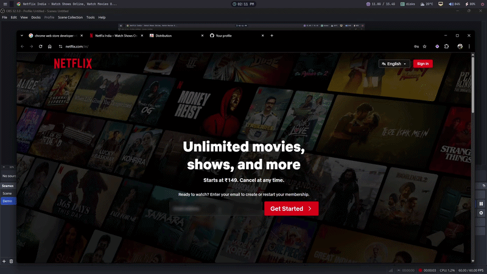

# Riku — kaizeldev

**I find real problems and build practical software that ships.**

Solo founder, building in public. I work across whatever a problem needs — browser extensions, AI-assisted research and product systems, internal tools, and business software — and I'm drawn more to the messy, overlooked problems than the clean ones: hidden subscriptions, fragmented workflows, decisions buried in noise.

[rikurynjah.com](https://rikurynjah.com) · building in public at [@build.signal](https://instagram.com/build.signal)

<!--
PROJECTS SECTION — editing rules, keep these consistent.

Status vocabulary (use only these): Live · Active · In use · Seeking users · Paused · Private

Structure:
  - "What I'm building" = current focus. "Also built / in progress" = everything else.
  - Adding a project  = one new line under the right group.
  - Status change     = edit the italic tag, or move the line between groups.
  - Umbrella products = nest as sub-bullets under the parent (see Latch under Firewall).

Known traps — do not repeat:
  - Firewall and Latch are ONE project. Firewall is the umbrella; Latch is its first
    shipped product. Never list them as peers, never count them twice.
  - Atlas is internal infrastructure for Asteria only. It is NOT its own project entry.
  - Altair stays opaque: name only, no description of what it does.
  - Do not resurrect AgentOS (discontinued) or add mcp-cost-estimator.
  - Latch does NOT do Gmail detection or dark-pattern detection. Dark-pattern /
    payment defense is a Firewall roadmap goal, not a shipped Latch feature.
-->

## 🚀 What I'm building

### 🔹 Firewall — *active*
Umbrella project aimed at subscription dark patterns and consumer payment defense. The larger vision is on the roadmap; I'm validating it before committing to a full-scale build.

- **Latch** — *live* · Firewall's first product. A browser extension that detects subscriptions at checkout, tracks price and renewal dates, and reminds you before the next charge. Local-only, no accounts.
  [Chrome](https://chromewebstore.google.com/detail/latch/hhlanhjmpcibeiipacflmkcgihibenkp) · [Firefox](https://addons.mozilla.org/en-US/firefox/addon/latch-subscription-tracker/)

### 🔹 Altair — *private*
A project I'm building deliberately behind closed doors. Details withheld for now.

---

## 🛠 Also built / in progress

- **Kulin** — *active (~95%)* · a billing and payment-management system.
- **Restaurant direct-ordering system** — *seeking users* · a productized ordering system for restaurants — built, and looking for its first customers.
- **Callisto** — *in use* · a Python pipeline for pulling and cleaning YouTube transcripts at scale.
- **Asteria** — *live* · a GLP-1 patient guide, *The First 90 Days on GLP-1s*, written from analysis of thousands of real patient discussions. [Free chapter](https://gumroadriku.gumroad.com/l/cadlgs) · [Full guide](https://gumroadriku.gumroad.com/l/hlbwrf)
- **Kaizel** — *paused* · a multi-agent orchestration pipeline for my own dev workflow. Parked while I focus elsewhere.

## ⚙️ Stack

**Core**  
Python • asyncio • Pydantic • Flask

**Frontend / Extensions**  
JavaScript / Node • React • Plasmo (MV3)

**Data**  
PostgreSQL + pgvector

**AI / Tooling**  
Local LLMs via Ollama • Gemini • Claude • Docker

**Environment**  
Arch Linux • Terminal-first workflow

## 📡 Building in Public

→ [@build.signal](https://instagram.com/build.signal)

## ⚡ Perspective

Most tools solve clean, obvious problems.

I'm interested in the messy ones:
- hidden subscriptions
- fragmented workflows
- operators without systems

Build → test → iterate → repeat.

## 🤝 Open to

- Collaborations on AI tools and automation systems
- Feedback on my projects
- Early users interested in testing and giving input

If you're building something interesting or want to connect, feel free to reach out.

## 🔗 Elsewhere

[rikurynjah.com](https://rikurynjah.com) · [@build.signal](https://instagram.com/build.signal) · [Gumroad](https://gumroadriku.gumroad.com)
